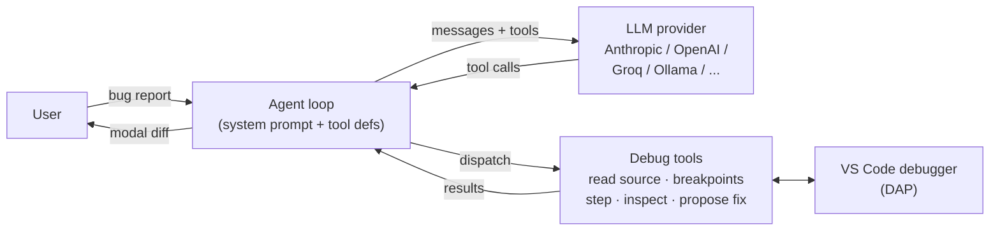
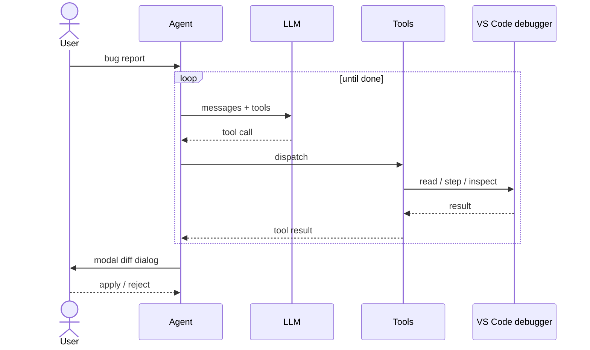

# Project Broccoli — Architecture

A VS Code extension that gives LLM agents structured debugging tools (breakpoints, stepping, variable inspection, source reading) via the Debug Adapter Protocol. The agent runs *inside* the extension host; the LLM is provider-pluggable.

---

## 1. Goal

Replace "agent reads stack trace, guesses fix" with "agent drives the debugger, observes runtime state, proposes a fix the user gates via a diff dialog."

Two non-negotiables:

- **No code execution in the debuggee.** The agent cannot evaluate arbitrary expressions in the target process. Bug reports or test fixtures cannot prompt-inject the agent into running shell commands.
- **No automatic source mutation.** Every code change is shown as a modal diff and applied only after explicit user approval.

---

## 2. Component diagram



The agent only ever sees the **Debug tools** surface; the LLM provider is swapped behind a single `LLMClient` interface; every code change funnels through the modal diff back to the user.

---

## 3. Modules

| Module | Role | Why it exists |
|---|---|---|
| `extension.ts` | Activates the extension, registers commands, owns the singleton `DebugSessionController`. | Single entry point. Surfaces typed errors as toasts; keeps activation lean. |
| `command-interface.ts` | Thin wrappers over `vscode.debug` and DAP `customRequest`s — start/step/continue, breakpoints, stack trace, variable inspection. | Isolates the rest of the codebase from the VS Code API surface. Throws `NoActiveDebugSessionError` instead of silently auto-starting (the previous behavior was surprising). |
| `session/DebugSessionController.ts` | Registers a `DebugAdapterTracker` that listens for raw DAP `stopped`/`terminated` events and turns them into awaitable promises (`waitForStop(timeoutMs)`). | **Replaces every `setTimeout(800)` race.** Before stepping, we *arm the waiter, then issue the command* — so we cannot miss a fast `stopped` event. |
| `agent/schemas.ts` | JSON Schema definitions for every tool the agent can call. | Provider-neutral. Same array feeds Anthropic's `input_schema` and OpenAI's `function.parameters`. Lines are 1-indexed everywhere; columns are 0-indexed; documented in the `propose_code_fix` description. |
| `agent/systemPrompt.ts` | The debugging-agent persona. | Forces the model to: (a) state hypotheses, (b) inspect before guessing, (c) call tools — never describe fixes in prose, code blocks, or unified-diff markdown, (d) finish early when stuck. |
| `agent/DebugTools.ts` | Tool dispatcher. Maps `tool_use` calls to `command-interface` primitives, combines them with `DebugSessionController` for awaitability, returns bounded JSON tool results. | The agent talks to *one* surface. Retains semantics like "armed waiter," "variable depth bound," "1-indexed → 0-indexed conversion for `propose_code_fix`," and "frame_index → real frameId resolution via `get_stack_trace`." |
| `agent/llm/types.ts` | `LLMClient` interface, `NormalizedMessage` union, `ToolSchema` shape. | Single seam for provider extension. The agent loop never imports a provider SDK. |
| `agent/llm/anthropic.ts` | `AnthropicClient` — uses native `tool_use` / `tool_result` blocks; tags `system` and the last tool entry with `cache_control: ephemeral`. | Anthropic's prompt-caching API requires explicit markers; the markers are confined to this file. |
| `agent/llm/openaiCompat.ts` | `OpenAICompatClient` — Chat Completions + `tool_calls` shape. Used for OpenAI, Groq, DeepSeek, Together, xAI, Ollama, and any custom OpenAI-compatible URL. | One client, many providers. Adds: `sanitizeSchema` (strips `default`/`examples`/`$id` keywords Groq's validator rejects), `sanitizeCall` (recovers malformed `function.name = "tool({…})"` patterns from weaker models), `callWithRetry` (one retry on 400 with backoff; logs `failed_generation`). |
| `agent/llm/index.ts` | `createClient(config)` factory, provider presets, `detectProviderFromKey`. | Provider knowledge in one place; `Agent.ts` stays clean. |
| `agent/secrets.ts` | Provider-config wizard (multi-step QuickPick → InputBox), JSON-encoded into `vscode.SecretStorage`. | Secrets never touch source or workspace files. Wizard supports key validation per provider (e.g. `sk-ant-` for Anthropic, free-form for Ollama). |
| `agent/AnthropicAgent.ts` | The agent loop: build messages, call `LLMClient.step`, dispatch tool calls, append `tool_result`s, repeat. Caps at `MAX_TURNS=25`. | Provider-agnostic despite the legacy filename. Handles cancellation via `CancellationToken` → `AbortSignal`; recovers from text-as-tool-call (synthesizes `propose_code_fix` / `finish` from JSON-in-text) and text-as-fix (nudges the model with a corrective user message, capped at 2 nudges). |
| `orchestrator/debug-agent.ts` | The user-facing entry point. Asks for the bug description and active-file context, hands them to `runAgent`, ensures the debug session is stopped in `finally`. | Lifecycle ownership in one place. Failures during the run never leave a dangling debug session. |
| `orchestrator/diff.ts` | `showPreviewAndConfirm`: opens a `vscode.diff` view, then shows a **modal** information dialog. Returns a boolean to the agent. | Modal (not toast) — the dialog stays open until the user decides; the agent loop blocks on the await. The boolean lets the model see whether its proposal was accepted. |

---

## 4. End-to-end run



---

## 5. Provider abstraction & caching

| Provider | Tool-call shape | Caching | Notes |
|---|---|---|---|
| **Anthropic** | `tool_use` / `tool_result` blocks | Explicit `cache_control: ephemeral` on `system` and the last tool entry. 5-min TTL. | Cheapest reads (~10% of base) on cache hit, 25% surcharge on the first write. |
| **OpenAI** | `tool_calls` array; `role: "tool"` results | Automatic for prefixes ≥1024 tokens. | Our system prompt + ~16 tool defs (~2 KB) clears the threshold; cache hits "for free." |
| **Groq** | OpenAI-compatible | Automatic on supported models. | `sanitizeSchema` strips `default`/`examples` (Groq rejects them). `temperature: 0.2` reduces malformed tool calls from Llama. |
| **DeepSeek / Together / xAI** | OpenAI-compatible | Automatic per provider. | Configured by base URL in `OPENAI_COMPAT_PRESETS`. |
| **Ollama (local)** | OpenAI-compatible (newer models) | KV-cache hits while the prefix is stable. | API key field is optional. |
| **Custom** | OpenAI-compatible | Same as above. | User supplies base URL via wizard. |

The agent loop only ever **appends** to `messages`; the system prompt and tool defs are byte-stable across turns. That property — not any provider-specific flag — is what produces near-optimal cache hits everywhere.

---

## 6. Safety boundaries

These are properties of the implementation, not just the prompt.

| Property | Mechanism |
|---|---|
| Agent cannot run arbitrary code in the debuggee | `evaluate_expression` was removed. The remaining DAP calls (`scopes`, `variables`, `stackTrace`, `setBreakpoints`) are read-only / control-flow only. |
| Agent cannot read arbitrary host files | `read_source` rejects any path outside an open workspace folder. Path is `path.resolve`'d first; check is `target === root \|\| target.startsWith(root + sep)`. |
| Agent cannot mutate source without consent | `propose_code_fix` always routes through the modal `showPreviewAndConfirm` dialog. The boolean result is fed back so the model can react to a rejection. |
| Off-by-one cannot delete unintended lines | `propose_code_fix` schema is documented as 1-indexed; `DebugTools.proposeFix` subtracts 1 before constructing `vscode.Position`. (Earlier bug fixed: lines were being applied at line N+1.) |
| Secrets never touch source or workspace | Only `vscode.SecretStorage` via `secrets.ts`. No `.env` reads, no settings.json. |
| Stuck loops cannot run forever | `MAX_TURNS = 25` hard cap; user `CancellationToken` → `AbortSignal` aborts in-flight HTTP. |
| Dangling debug sessions cannot leak | `debug-agent.ts` finally-block calls `stopDebugger()` if `controller.session` is still alive. |
| Weak models that emit tool args as text cannot silently drop fixes | Two-stage recovery: (1) `recoverToolCallFromText` parses JSON-in-text and synthesizes a real `tool_use`; (2) `looksLikeFixIntent` detects markdown/diff fix descriptions and nudges the model with a corrective user message (cap 2). |
| Provider-side validator failures cannot kill the loop | `OpenAICompatClient.callWithRetry` retries once on 400 with 400 ms backoff and surfaces `failed_generation` to the dev console. |

---

## 7. Tool inventory

Every tool has a real JSON Schema in `agent/schemas.ts` (`required`, types, descriptions). The agent has access to:

- **Source visibility:** `read_source` (workspace-scoped, line-numbered, range-able)
- **Breakpoints:** `add_breakpoint` (with `condition`), `remove_breakpoint`, `list_breakpoints`
- **Session lifecycle:** `start_debug_session`, `restart_debug_session`, `stop_debug_session`
- **Stepping:** `continue_execution`, `step_over`, `step_into`, `step_out` — each returns the new stop reason + top frame + variables snapshot in one round-trip
- **State inspection:** `get_stack_trace`, `inspect_variables` (frame_index resolved → frameId), `expand_variable` (drill into nested by `variables_reference`)
- **Output:** `propose_code_fix` (modal diff), `finish` (terminate with summary)

What the agent cannot do: evaluate expressions, write to source without confirmation, read outside the workspace, run shell commands, hit the network from inside the debuggee.

---

## 8. Intentionally deferred

- **MCP server mode.** The `DebugTools` interface is the seam an MCP server would attach to (stdio transport, `debug://*` resources, `notifications/stopped`). Not built — out of scope for the current API-token path.
- **Critique LLM.** The original diagram had one. Deferred until evidence the actor underperforms; doubling cost/latency on every turn isn't worth it yet.
- **Conditional/function/data breakpoint variants.** Only conditional source breakpoints are exposed today (`add_breakpoint.condition`). Adding others is a schema-only change.
- **Context compaction.** `MAX_TURNS=25` and bounded tool results (8 KB) keep the window in check today. A summarize-and-replace step is the next defense if longer sessions are needed.

---

## 9. File map

```
src/
  extension.ts                       commands + activation
  command-interface.ts               DAP primitives
  agent/
    schemas.ts                       tool definitions (JSON Schema)
    systemPrompt.ts                  debugging persona
    DebugTools.ts                    tool dispatcher
    secrets.ts                       provider wizard + SecretStorage
    AnthropicAgent.ts                runAgent loop (provider-agnostic)
    llm/
      types.ts                       LLMClient + Normalized* types
      anthropic.ts                   AnthropicClient
      openaiCompat.ts                OpenAICompatClient (+ sanitizers, retry)
      index.ts                       createClient + presets
  session/
    DebugSessionController.ts        DAP event tracker, waitForStop
  orchestrator/
    debug-agent.ts                   user-facing entry point
    diff.ts                          modal preview + confirm
```
